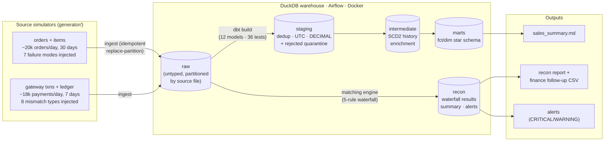

# data-platform

[](https://github.com/Tasachii/data-platform/actions/workflows/ci.yml)

End-to-end data platform for a simulated Thai e-commerce/logistics company:
daily order ingestion with realistically dirty data, dbt warehouse modeling,
payment reconciliation, Airflow orchestration — all runnable locally at zero
cost, tested down to 100% recall of every injected failure mode.



## Pipelines

| Pipeline | What it proves | Docs |
|---|---|---|
| **Orders** — daily batch, 600k orders | Idempotent incremental loads, late-arriving data, SCD2, refund restatement to original date, fact-grain discipline | [`pipelines/orders/`](pipelines/orders/README.md) |
| **Reconciliation** — gateway vs ledger, 125k txns | Normalization-first matching waterfall, duplicate detection, alerting, 100% recall of injected mismatches | [`pipelines/reconciliation/`](pipelines/reconciliation/README.md) |

Both pipelines describe **one business**: the reconciliation payments are
derived from the orders pipeline's own data.

## Quickstart (local, ~2 minutes)

```bash
python3 -m venv .venv && source .venv/bin/activate
pip install -r requirements.txt

python generator/generate_orders.py            # 30 days of dirty source data
python generator/generate_payments.py          # 7 days of payments to reconcile

python pipelines/orders/run_pipeline.py --all  # ingest → dbt build → report → 52 tests
python pipelines/reconciliation/run_recon.py --all
```

Backfill any window without touching other days:

```bash
python pipelines/orders/run_pipeline.py --date 2026-06-15
python pipelines/orders/run_pipeline.py --start 2026-06-01 --end 2026-06-07
```

## Quickstart (Airflow on Docker)

```bash
docker compose up -d          # UI at http://localhost:8080  (admin/admin)

# or execute a full DAG headlessly:
docker compose exec airflow-scheduler airflow dags test orders_daily 2026-06-15
docker compose exec airflow-scheduler airflow dags test recon_daily 2026-06-28
```

DAGs: `orders_daily` (ingest → dbt build → report → quality gate) and
`recon_daily` (ingest → match+alert → report).

## How this is tested

The generators write a **manifest of every corruption they inject** — 12,298
duplicate resends, 15,561 retroactive refunds, 5,800 late arrivals, 3,000
broken amounts, 6,000 orphan customers, 1,880 payments missing from the
ledger, 617 double postings, and more. The test suite (52 pytest tests + 36
dbt schema tests) then proves the pipelines catch **all of them**:

- every edge case maps to a named test (recall, not vibes)
- full-pipeline idempotency is proven by checksumming all tables across a
  complete re-run in a subprocess
- each reconciliation rule has isolated unit tests on in-memory fixtures
- money reconciles across layers to the satang — because it's DECIMAL, not float

CI runs the entire platform (generate → pipelines → tests) on every push.

## Design decisions

Every non-obvious choice has an ADR in [`docs/decisions/`](docs/decisions/):
DuckDB as warehouse (000/001), DECIMAL money (002), UTC storage with
Asia/Bangkok reporting (003), idempotency contracts (004), refund
restatement (005), scripts→dbt→Airflow phasing (006), fact grain — including
the 2.2x order-count inflation bug it fixes (007), and the reconciliation
waterfall's similarity guard (008).

## Repo layout

```
generator/                 source-system simulators (+ corruption manifests)
pipelines/orders/          ingest, runner, report, analyst queries
pipelines/reconciliation/  ingest, matching engine, alerting, report
dbt/                       models (staging/intermediate/marts) + schema tests
dags/                      Airflow DAGs
tests/                     52 pytest tests: quality, recall, idempotency, unit
docs/decisions/            ADR-000 … ADR-008
reports/                   generated business reports (markdown)
```

## Limits I know about

- DuckDB is single-writer → `max_active_runs=1`; the BigQuery migration path
  is in `docs/backlog.md`.
- Transforms are full-refresh — right up to ~millions of rows, then the marts
  become incremental models keyed on `business_date` (ADR-004).
- Payment volume is order-derived (~18k/day), below a big fintech's 50k+/day;
  the matching logic is volume-independent.
